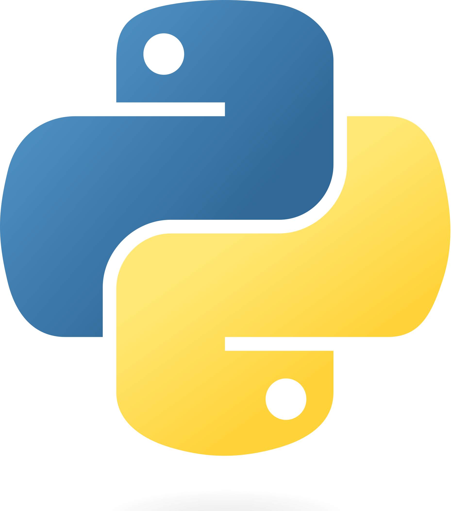

.. Your Project Name Documentation documentation master file, created by
   sphinx-quickstart on Tue Jul 16 10:34:20 2024.
   You can adapt this file completely to your liking, but it should at least
   contain the root `toctree` directive.

Planning Service Python API
===================================================

Planning-service is a microservice for robot motion planning.

Setup
***************************
To perform the setup, you need to install the client library. You can install it using pip:

.. code-block:: bash

   pip install -e .

.. toctree::
   :caption: API Documentation
   :titlesonly:

   iris_client
   planner_client
   visualizer
   type
   proto

.. toctree::
   :caption: Example
   :titlesonly:

   example

Indices and tables
==================

* :ref:`genindex`
* :ref:`modindex`
* :ref:`search`
